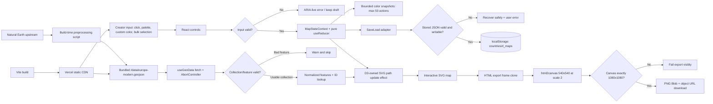

# Phase 1: Foundation & Modern Map - Research

**Researched:** 2026-07-21
**Domain:** Browser-only React/D3 choropleth editor, deterministic PNG export, and local persistence
**Confidence:** HIGH

<user_constraints>
## User Constraints (from CONTEXT.md)

The following constraints are copied verbatim from `01-CONTEXT.md`; provenance for the entire block is `[CITED: .planning/phases/01-foundation-modern-map-1-1-5-weeks/01-CONTEXT.md]`.

### Locked Decisions

### Locked Stack and Runtime
- D-01: Use React 18 with TypeScript in strict mode; do not upgrade the phase to React 19.
- D-02: Use Vite as the build/dev tool and `@vitejs/plugin-react` as the React integration.
- D-03: Use D3.js v7+ for geographic projection, GeoJSON-to-SVG path generation, data joins, and map interaction support.
- D-04: Render the map as interactive SVG, not Canvas, Mapbox, or a custom raster renderer.
- D-05: Use React Context plus `useReducer` as the centralized map-state mechanism exposed through `useMapState`.
- D-06: Use html2canvas for PNG generation.
- D-07: Use browser `localStorage` for map save/load/delete; no backend, authentication, mandatory login, or server infrastructure.
- D-08: Deploy the static Vite app to Vercel and make a shareable production URL part of Phase 1 completion.
- D-09: Use plain component-scoped CSS plus CSS custom properties in `theme.css`; do not add Tailwind or CSS-in-JS.
- D-10: Target current Chrome, Firefox, Safari, and Edge (last two versions); no IE11 support.

### Application and File Architecture
- D-11: Preserve the PRD subsystem layout: `src/types`, `src/components`, `src/hooks`, `src/utils`, `src/styles`, `src/constants`, and `public/data/europe-modern.geojson`.
- D-12: Core modules are `useMapState`, `useGeoData`, `useLocalStorage`, `MapCanvas`, `ColorPicker`, `CountryList`, `Controls`, `SaveLoad`, `Tooltip`, `exportMapPng`, GeoJSON/color/storage utilities, and shared constants/types.
- D-13: Components are functional, one primary component per file, with explicitly typed props and stable handlers/keys.
- D-14: D3 owns only the SVG subtree it creates or updates; React and D3 must not independently mutate the same SVG nodes.
- D-15: Illustrative PRD snippets do not override executable constraints. Implementation must correct sample defects that would break Vite, strict TypeScript, React ref wiring, history bounds, or exact export dimensions while preserving every locked user-visible outcome.
- D-16: Vite's application `index.html` belongs at the repository root. `public/` is reserved for static assets, including the bundled GeoJSON.

### Modern Europe Data and Map Rendering
- D-17: Source modern country boundaries from Natural Earth's 1:10m Admin 0 Countries data and commit a Europe-focused GeoJSON asset at `public/data/europe-modern.geojson` so the map works without runtime calls to third-party APIs.
- D-18: Normalize every accepted feature to a stable unique string `id`, a non-empty `properties.name`, and Polygon or MultiPolygon geometry before rendering.
- D-19: On load, validate the payload and each feature. Skip malformed entries with a warning and continue rendering valid countries; show a user-facing load error if the file cannot be fetched or the collection is unusable.
- D-20: Load the GeoJSON once on mount, abort fetch work on unmount, cache normalized features, and build an O(1) country lookup keyed by feature ID.
- D-21: Use `d3.geoMercator()`, `projection.fitExtent(...)`, and `d3.geoPath()` for the Phase 1 Europe view. Centering/reprojection controls remain deferred.
- D-22: Each country is a stable SVG path with hover feedback, country-name/current-color tooltip content, click/tap selection, accessible labeling, and a clearly differentiated selected border.
- D-23: Default country fill and reset state are white (`#FFFFFF`). Default borders are light gray; selected borders are black and visibly thicker.
- D-24: Keep projection/path geometry stable across color edits. Color or selection updates must update attributes/classes rather than clear and rebuild the whole SVG.

### Selection, Coloring, and History
- D-25: A user can click/tap any rendered country to select it and can also select multiple countries through the country-list/bulk workflow.
- D-26: Provide 8–10 palette presets plus custom color input. Accept valid `#RGB`, `#RRGGBB`, and `rgb(r,g,b)` forms; reject invalid or out-of-range input with visible feedback.
- D-27: Support applying one color to one country and applying the same color to multiple selected countries as a single reducer action.
- D-28: Keep color assignments as `Record<string, string>` keyed only by normalized country ID.
- D-29: Support reducer actions equivalent to `SET_COLOR`, `SET_COLORS`, `RESET_ALL`, `UNDO`, `REDO`, `SELECT_COUNTRY`, and `LOAD_STATE`.
- D-30: Undo/redo uses immutable full color snapshots, discards the redo branch after a new edit, and retains at most the last 50 color-changing actions. Selection-only actions do not create history entries.
- D-31: Undo, redo, and reset controls reflect availability; no-op actions must not create duplicate history snapshots.
- D-32: Loading a saved map replaces current colors and resets undo/redo history to that loaded state.
- D-33: Color assignment should feel immediate, but custom-input editing must not create a history entry for every invalid or partial keystroke; commit one validated user intent per action.

### Persistence
- D-34: Store saved maps under the exact key `countriesirl_maps` as JSON records containing `name`, `colors`, and `timestamp`.
- D-35: Support listing, saving, overwriting by matching name, loading, and deleting saved maps.
- D-36: Keep at most 10 saved maps. A newly saved/updated map is most recent; if capacity is exceeded, discard the oldest record.
- D-37: Trim and validate non-empty map names. Treat parsed localStorage content as untrusted: catch parse errors, validate record shape/colors, and recover without crashing.
- D-38: Handle unavailable/restricted storage and quota failures with explicit success/error results and user-facing feedback.
- D-39: Saved maps remain local to the current browser/origin and contain no credentials or sensitive data.

### PNG Export
- D-40: Export a white-background PNG that is exactly 1080×1080 pixels and visually matches the current map colors.
- D-41: Use html2canvas against an HTML export container that contains the SVG; do not pass an `SVGSVGElement` directly to an API typed for `HTMLElement`.
- D-42: Use deterministic export sizing independent of device pixel ratio. The required 2× quality path must either capture a 540×540 CSS export frame at scale 2 or explicitly downsample a higher-resolution intermediate canvas to an exact 1080×1080 output canvas.
- D-43: Use `canvas.toBlob()` and an object URL for download, revoke the URL after use, and clean temporary DOM in `finally`.
- D-44: Filename format is `CountriesIRL_<YYYY-MM-DD>.png`; no spaces or special characters.
- D-45: Export control has a disabled/loading state while work is active, completes in under 3 seconds on the target map, and reports failures without crashing the app.
- D-46: Avoid cross-origin images/fonts/resources in the export subtree so canvas output is not tainted.

### UX, Responsive Behavior, Accessibility, and Theme
- D-47: Optimize for non-technical creators: a user must be able to color at least five countries in under two minutes without documentation.
- D-48: Provide clear hover/selection feedback, current-color preview, concise control labels, first-use help such as “Click a country to start,” and visible success/error feedback.
- D-49: Desktop is primary; the layout must also work smoothly on tablets, with mobile support secondary rather than a native/mobile-app scope.
- D-50: Provide basic system-preference dark-theme behavior through CSS variables without inverting or corrupting exported map colors.
- D-51: Use semantic buttons, visible focus states, labels or `aria-label`s, SVG country labels/titles, and keyboard-operable controls. Do not rely on color alone for selection state.
- D-52: Keep color transitions around 150 ms and other UI transitions short enough to feel responsive without blocking state updates.

### Quality, Testing, and Delivery
- D-53: Map load/projection/render target is under 500 ms on the Phase 1 Europe dataset; color changes, undo, and redo should complete within 100 ms from user action to visible update.
- D-54: PNG export target is under 3 seconds and must be verified as exactly 1080×1080.
- D-55: The app must survive 100+ rapid interactions without crashes, broken history, duplicate SVG nodes, stale selections, or console errors/warnings from valid data.
- D-56: Strict TypeScript is mandatory: no `any`, no implicit function return types, no unsafe assertions used to hide incompatible DOM/API contracts, and no magic numbers where named constants apply.
- D-57: Provide unit tests for reducer/history behavior and utilities, covering happy paths, edge cases, malformed data/storage, action limits, and error conditions. Visual SVG/component flows and final browser export may use the documented Phase 1 manual checklist.
- D-58: Production acceptance requires `npm run lint`, the automated test suite, and `npm run build` to pass.
- D-59: Existing coding-rule documents are authoritative. Do not replace them from templates; make only targeted, reviewed updates when implementation establishes a durable new rule or corrects a demonstrated technical error.
- D-60: Completion includes a production Vercel deployment, a working shareable URL, no required `.env.local`, and no product-code dependency on Vercel environment variables.

### Claude's Discretion
- Choose the exact current package patch versions compatible with React 18, Vite, the installed Node runtime, and the locked stack.
- Choose the deterministic Natural Earth preprocessing procedure, exact Europe/transcontinental inclusion policy, and stable ID fallback order while preserving the fixed data source and normalized runtime contract.
- Choose the exact internal representation of transient bulk-selection UI state while reducer color/history semantics remain fixed.
- Choose the precise component visual design, CSS token values, responsive breakpoints, tooltip/toast implementation, and modal details while satisfying the locked UX, accessibility, responsive, and theme outcomes.
- Choose the test file layout and test framework configuration, subject to the project's unit-test requirements and `.planning/config.json` Nyquist validation setting.
- Choose whether the export implementation uses a 540×540 scale-2 capture or a larger intermediate canvas followed by explicit downsampling, provided the downloaded file is deterministically 1080×1080.
- Choose whether data preparation is a retained script or a documented one-time transformation, provided provenance and reproducibility are recorded and product runtime stays browser-only.

### Deferred Ideas (OUT OF SCOPE)
- Historical border datasets and time-period selector/redraw.
- Flexible centering or reprojection around a selected country.
- EU-only, EU + Middle East, Europe + Russia, and other regional zoom presets.
- Auto-generated legend, editable legend labels, legend positioning, and legend styling.
- Batch/timelapse export, ZIP generation, or multiple-image workflows.
- SVG export and other editable/export formats beyond the locked PNG deliverable.
- Palette-color hotkeys and advanced keyboard shortcuts beyond basic accessibility.
- Advanced styling such as hatching, patterns, in-country labels, or animated transitions.
- Non-European regions, a native mobile app, real-time collaboration, cloud sync, authentication, share URLs, analytics, and AI palette suggestions.
- Server functions, databases, and secret/environment-variable-driven product behavior.
</user_constraints>

## Project Constraints (from CLAUDE.md)

- Read `.planning/coding-rules/general.md` before implementation, then the matching domain rule file; these documents already exist and are authoritative. `[CITED: CLAUDE.md]`
- Use React 18, TypeScript, Vite, D3 v7+, html2canvas, localStorage, and Vercel; Phase 1 is browser-only and needs no `.env.local`. `[CITED: CLAUDE.md]`
- Validate GeoJSON IDs and names at load time, skip malformed features with a warning, and never crash the map because one feature is bad. `[CITED: CLAUDE.md]`
- Every exported PNG must be exactly 1080×1080 pixels. `[CITED: CLAUDE.md]`
- TypeScript strict mode, explicit function signatures, no `any`, semantic controls, stable keys, bounded performance, and utility unit tests are mandatory. `[CITED: .planning/coding-rules/general.md]`
- D3 DOM work must remain inside an effect/ref-owned subtree, and color updates must not rebuild the SVG. `[CITED: .planning/coding-rules/frontend.md]`
- Storage key, max-map limit, schema, and load-history reset are fixed by the storage rules. `[CITED: .planning/coding-rules/storage.md]`
- The exact export contract, white background, filename, cleanup, and visible error handling are fixed by the export rules, but sample code must be corrected where official API typing or scale arithmetic proves it invalid. `[CITED: .planning/coding-rules/export.md] [CITED: html2canvas.hertzen.com/configuration/]`

## Summary

The repository is greenfield from a product-code perspective: it has no `package.json`, `src/`, tests, or GeoJSON asset, while its planning and coding-rule documents are already present. `[VERIFIED: project inspection]` Phase 1 should therefore begin with a non-destructive application/test shell rather than running the current Vite generator directly into the non-empty repository. A temporary `create-vite` scaffold currently defaults to React 19 and Oxlint, which conflicts with the locked React 18 and ESLint requirements. `[VERIFIED: create-vite scaffold] [CITED: .planning/phases/01-foundation-modern-map-1-1-5-weeks/01-CONTEXT.md]`

The central implementation shape is a one-way browser data flow: static Natural Earth data is fetched and normalized once; a pure reducer owns colors, selection, and bounded history; D3 owns the map's SVG paths through a ref-backed effect; controls dispatch semantic actions; storage and export sit behind narrow utility APIs. `[CITED: react.dev/reference/react/useReducer] [CITED: d3js.org/getting-started] [CITED: .planning/PHASE1_CODEX_BRIEF.md]` The two highest-risk technical points are not map coloring itself: they are deterministic export and source-data normalization. html2canvas accepts an `HTMLElement`, defaults `scale` to the device pixel ratio, and multiplies configured dimensions by scale; the PRD's direct-SVG and 1080-at-scale-2 examples would either fail strict typing or produce the wrong pixel dimensions unless corrected. `[CITED: github.com/niklasvh/html2canvas/blob/master/src/index.ts] [CITED: html2canvas.hertzen.com/configuration/]`

Natural Earth's official website lists Shapefile/geodatabase/TIFF rather than GeoJSON, while its official vector repository includes generated GeoJSON whose upstream properties use keys such as `ADMIN`, `NAME`, and `ISO_A3` rather than the app's normalized `properties.name`. `[CITED: naturalearthdata.com/downloads/10m-cultural-vectors/10m-admin-0-countries/] [CITED: github.com/nvkelso/natural-earth-vector]` Retain a deterministic Node preprocessing script that fetches or reads the upstream file, filters the Phase 1 Europe set, normalizes IDs/names/geometries, and writes the committed runtime asset plus provenance metadata. `[CITED: github.com/nvkelso/natural-earth-vector/blob/master/Makefile] [CITED: .planning/coding-rules/data.md]`

**Primary recommendation:** Build a manually pinned React 18/Vite 8 shell, then implement the vertical path `normalized GeoJSON → pure bounded reducer → D3-owned SVG → local persistence → deterministic 1080×1080 html2canvas export`, with Vitest utility/state coverage and a manual browser acceptance pass. `[VERIFIED: npm registry] [CITED: .planning/CODEX_PROMPT.md]`

## Architectural Responsibility Map

| Capability | Primary Tier | Secondary Tier | Rationale |
|------------|-------------|----------------|-----------|
| App shell, responsive controls, color selection, help, modal UI | Browser / Client | CDN / Static | All interactions are local React state and static assets; no backend is in scope. `[CITED: .planning/CODEX_PROMPT.md]` |
| Projection and country-path rendering | Browser / Client | CDN / Static | D3 transforms bundled GeoJSON into SVG paths in the browser. `[CITED: d3js.org/d3-geo/path]` |
| GeoJSON provenance/preprocessing | Build / Tooling | CDN / Static | A deterministic script creates the normalized committed asset; production only serves the result. `[CITED: github.com/nvkelso/natural-earth-vector/blob/master/Makefile]` |
| Color state and undo/redo | Browser / Client | — | A pure React reducer owns current colors and snapshots. `[CITED: react.dev/reference/react/useReducer]` |
| Save/load/delete | Browser / Client | Browser Storage | A typed adapter validates and persists JSON in localStorage. `[CITED: developer.mozilla.org/en-US/docs/Web/API/Web_Storage_API/Using_the_Web_Storage_API]` |
| PNG export/download | Browser / Client | — | html2canvas, Canvas, Blob, and object URLs are browser APIs. `[CITED: html2canvas.hertzen.com/configuration/] [CITED: developer.mozilla.org/en-US/docs/Web/API/HTMLCanvasElement/toBlob]` |
| Hosting and static delivery | CDN / Static | — | Vercel serves the Vite production build; no functions or SSR are needed. `[CITED: vercel.com/docs/frameworks/frontend/vite]` |
| Authentication, sessions, APIs, database | Out of scope | — | The locked phase is browser-only and has no login/backend. `[CITED: .planning/CODEX_PROMPT.md]` |

## Standard Stack

### Core

| Library | Version / Published | Purpose | Why Standard |
|---------|---------------------|---------|--------------|
| `react` | 18.3.1 / 2024-04-26 `[VERIFIED: npm registry]` | Component and hook runtime | Latest React 18 patch preserves the locked major while supplying the official reducer/context model. `[CITED: react.dev/reference/react/useReducer]` |
| `react-dom` | 18.3.1 / 2024-04-26 `[VERIFIED: npm registry]` | Browser root rendering | Official React browser renderer, pinned to the same patch as React. `[CITED: react.dev/learn/add-react-to-an-existing-project]` |
| `d3` | 7.9.0 / 2024-03-12 `[VERIFIED: npm registry]` | Projection, path generation, selection, and SVG data joins | Official D3 geo APIs directly implement `geoMercator`, `fitExtent`, and `geoPath`. `[CITED: d3js.org/d3-geo/projection] [CITED: d3js.org/d3-geo/path]` |
| `html2canvas` | 1.4.1 / 2022-01-22 `[VERIFIED: npm registry]` | Locked DOM-to-canvas PNG path | Official package required by the PRD; use explicit sizing and same-origin content because it reconstructs the DOM rather than taking a native screenshot. `[CITED: html2canvas.hertzen.com/documentation/]` |

### Build, Types, Tests, and Lint

| Library | Version / Published | Purpose | When to Use |
|---------|---------------------|---------|-------------|
| `vite` | 8.1.5 / 2026-07-16 `[VERIFIED: npm registry]` | Dev server and production build | Use for all local and production builds; it requires Node `^20.19.0 || >=22.12.0`. `[CITED: vite.dev/guide/]` |
| `@vitejs/plugin-react` | 6.0.3 / 2026-06-23 `[VERIFIED: npm registry]` | React Fast Refresh and JSX transform | Official Vite React plugin, compatible with Vite 8. `[CITED: vite.dev/plugins/]` |
| `typescript` | 6.0.2 / 2026-03-23 `[VERIFIED: npm registry]` | Strict static typing | Use 6.0.2, not registry-latest 7.0.2, because `typescript-eslint@8.65.0` declares support below TypeScript 6.1. `[VERIFIED: npm registry]` |
| `@types/react` | 18.3.31 / 2026-06-05 `[VERIFIED: npm registry]` | React 18 declarations | Match the locked React major. `[CITED: typescriptlang.org/docs/handbook/2/type-declarations]` |
| `@types/react-dom` | 18.3.7 / 2025-04-30 `[VERIFIED: npm registry]` | React DOM 18 declarations | Match the locked React DOM major. `[CITED: typescriptlang.org/docs/handbook/declaration-files/consumption.html]` |
| `@types/d3` | 7.4.3 / 2023-11-07 `[VERIFIED: npm registry]` | D3 declarations | Required for strict typed selections, projections, and event data. `[CITED: typescriptlang.org/docs/handbook/2/type-declarations]` |
| `@types/geojson` | 7946.0.16 / current `[VERIFIED: npm registry]` | Canonical GeoJSON geometry types | Install directly rather than relying only on `@types/d3-geo`'s transitive dependency. `[CITED: typescriptlang.org/docs/handbook/declaration-files/consumption.html]` |
| `vitest` | 4.1.10 / 2026-07-06 `[CITED: vitest.dev/guide/]` `[WARNING: slopcheck flagged as suspicious because its name resembles Vite; official docs and repository confirm it, but planner must add a human-verification checkpoint before install.]` | Unit tests for reducer and utilities | Vite-native TypeScript runner; no browser DOM package is needed for pure reducer/validation/storage-adapter tests. `[CITED: vitest.dev/guide/]` |
| `eslint` | 10.7.0 / 2026-07-10 `[VERIFIED: npm registry]` | Required `npm run lint` command | Use flat config; ESLint 10 requires the modern config format. `[CITED: eslint.org/docs/latest/use/configure/configuration-files]` |
| `@eslint/js` | 10.0.1 / 2026-02-06 `[VERIFIED: npm registry]` | Base JS recommendations | Official ESLint flat-config package. `[CITED: eslint.org/docs/latest/use/getting-started]` |
| `typescript-eslint` | 8.65.0 / 2026-07-20 `[VERIFIED: npm registry]` | TypeScript parser and recommended rules | Official TypeScript ESLint flat-config integration. `[CITED: typescript-eslint.io/getting-started/]` |
| `eslint-plugin-react-hooks` | 7.1.1 / 2026-04-17 `[VERIFIED: npm registry]` | Hook and effect correctness | Official React repository plugin; important for D3 effect dependencies/cleanup. `[CITED: npmjs.com/package/eslint-plugin-react-hooks]` |
| `globals` | 17.7.0 / 2026-06-22 `[VERIFIED: npm registry]` | Browser global declarations for lint | Use in the flat ESLint browser config rather than manually listing globals. `[CITED: eslint.org/docs/latest/use/configure/configuration-files]` |

### Alternatives Considered

No stack alternatives are recommended because React 18, D3 SVG, html2canvas, localStorage, plain CSS, and Vercel are locked user decisions. `[CITED: .planning/phases/01-foundation-modern-map-1-1-5-weeks/01-CONTEXT.md]` React 19, Canvas, Mapbox, IndexedDB, CSS-in-JS, and alternative export libraries are therefore out of scope for Phase 1 research. `[CITED: .planning/CODEX_PROMPT.md]`

**Installation:**

```bash
npm install --save-exact react@18.3.1 react-dom@18.3.1 d3@7.9.0 html2canvas@1.4.1
npm install --save-dev --save-exact \
  vite@8.1.5 @vitejs/plugin-react@6.0.3 typescript@6.0.2 \
  @types/react@18.3.31 @types/react-dom@18.3.7 \
  @types/d3@7.4.3 @types/geojson@7946.0.16 \
  eslint@10.7.0 @eslint/js@10.0.1 typescript-eslint@8.65.0 \
  eslint-plugin-react-hooks@7.1.1 globals@17.7.0 \
  vitest@4.1.10
```

Pin exact versions and commit `package-lock.json`; do not accept the current `create-vite` package manifest unchanged because it scaffolds React 19 and Oxlint. `[VERIFIED: create-vite scaffold] [CITED: .planning/phases/01-foundation-modern-map-1-1-5-weeks/01-CONTEXT.md]`

## Package Legitimacy Audit

All registry metadata, versions, creation dates, repositories, downloads, and absent `postinstall` fields were checked against npm. `[VERIFIED: npm registry]` Package names were also confirmed through official project documentation or official source repositories before approval. `[CITED: react.dev/learn/add-react-to-an-existing-project] [CITED: d3js.org/getting-started] [CITED: vite.dev/plugins/] [CITED: html2canvas.hertzen.com/getting-started/] [CITED: typescriptlang.org/docs/handbook/2/type-declarations] [CITED: eslint.org/docs/latest/use/getting-started] [CITED: typescript-eslint.io/getting-started/] [CITED: vitest.dev/guide/]`

| Package | Registry | Age | Downloads (last week) | Source Repo | slopcheck | Disposition |
|---------|----------|-----|-----------------------|-------------|-----------|-------------|
| `react` | npm | ~14.7 yrs | 160.1M | github.com/facebook/react | OK | Approved |
| `react-dom` | npm | ~12.2 yrs | 151.0M | github.com/facebook/react | OK | Approved |
| `d3` | npm | ~14.9 yrs | 15.9M | github.com/d3/d3 | OK | Approved |
| `html2canvas` | npm | ~11.5 yrs | 15.1M | github.com/niklasvh/html2canvas | OK | Approved |
| `vite` | npm | ~6.3 yrs | 157.1M | github.com/vitejs/vite | OK | Approved |
| `@vitejs/plugin-react` | npm | ~4.8 yrs | 74.9M | github.com/vitejs/vite-plugin-react | OK | Approved |
| `typescript` | npm | ~13.8 yrs | 238.4M | github.com/microsoft/TypeScript | OK | Approved at 6.0.2 |
| `@types/react` | npm | ~10.2 yrs | 138.9M | github.com/DefinitelyTyped/DefinitelyTyped | OK | Approved at React 18 line |
| `@types/react-dom` | npm | ~10.2 yrs | 113.1M | github.com/DefinitelyTyped/DefinitelyTyped | OK | Approved at React 18 line |
| `@types/d3` | npm | ~10.2 yrs | 15.4M | github.com/DefinitelyTyped/DefinitelyTyped | OK | Approved |
| `@types/geojson` | npm | ~10.2 yrs | 30.3M | github.com/DefinitelyTyped/DefinitelyTyped | OK | Approved |
| `eslint` | npm | ~13.0 yrs | 145.2M | github.com/eslint/eslint | OK | Approved |
| `@eslint/js` | npm | ~3.5 yrs | 129.6M | github.com/eslint/eslint | OK | Approved |
| `typescript-eslint` | npm | ~7.0 yrs | 80.3M | github.com/typescript-eslint/typescript-eslint | OK | Approved |
| `eslint-plugin-react-hooks` | npm | ~7.7 yrs | 89.8M | github.com/facebook/react | OK | Approved |
| `globals` | npm | ~13.7 yrs | 248.4M | github.com/sindresorhus/globals | OK | Approved |
| `vitest` | npm | ~4.6 yrs | 79.3M | github.com/vitest-dev/vitest | SUS | Flagged — planner must add `checkpoint:human-verify` |

**Packages removed due to slopcheck [SLOP] verdict:** none.

**Packages flagged as suspicious [SUS]:** `vitest` only. The slopcheck reason was name similarity to `vite`, while official Vitest documentation, npm metadata, and its established source repository independently confirm the intended package. `[CITED: vitest.dev/guide/] [VERIFIED: npm registry]`

**Postinstall audit:** none of the recommended packages exposed a registry `scripts.postinstall` value at research time. `[VERIFIED: npm registry]`

## Architecture Patterns

### System Architecture Diagram



The diagram reflects a browser-only service boundary and keeps Natural Earth acquisition outside production runtime. `[CITED: .planning/CODEX_PROMPT.md] [CITED: vercel.com/docs/frameworks/frontend/vite]`

### Recommended Project Structure

```text
index.html                         # Vite source entry; project root
package.json
package-lock.json
vite.config.ts
vitest.config.ts
eslint.config.js
tsconfig.json
tsconfig.app.json
tsconfig.node.json
scripts/
└── prepareGeoData.mjs             # deterministic Natural Earth filter/normalizer
public/
└── data/
    ├── europe-modern.geojson      # committed normalized runtime asset
    └── README.md                  # source version, license, POV, transform notes
src/
├── main.tsx
├── App.tsx
├── types/
│   ├── map.ts
│   └── ui.ts
├── constants/
│   ├── colors.ts
│   └── config.ts
├── hooks/
│   ├── useMapState.ts
│   ├── useMapState.test.ts
│   ├── useGeoData.ts
│   └── useLocalStorage.ts
├── components/
│   ├── MapCanvas.tsx
│   ├── ColorPicker.tsx
│   ├── CountryList.tsx
│   ├── Controls.tsx
│   ├── SaveLoad.tsx
│   └── Tooltip.tsx
├── utils/
│   ├── colors.ts
│   ├── colors.test.ts
│   ├── geojson.ts
│   ├── geojson.test.ts
│   ├── storage.ts
│   ├── storage.test.ts
│   ├── export.ts
│   └── export.test.ts
└── styles/
    ├── App.css
    ├── MapCanvas.css
    ├── Controls.css
    └── theme.css
```

The root `index.html` placement is required by Vite; `public/index.html` from the PRD sample is not a valid Vite source layout. `[CITED: vite.dev/guide/]` The retained preparation script avoids a non-reproducible manual data edit while adding no production dependency. `[CITED: github.com/nvkelso/natural-earth-vector/blob/master/Makefile]`

### Pattern 1: Pure, Bounded Snapshot Reducer

**What:** Centralize every color-changing transition through one `commitColors` helper that truncates redo history, skips no-op snapshots, and keeps `HISTORY_LIMIT + 1` snapshots including the current baseline. `[CITED: react.dev/reference/react/useReducer] [CITED: .planning/PHASE1_CODEX_BRIEF.md]`

**When to use:** `SET_COLOR`, `SET_COLORS`, and `RESET_ALL`; do not use it for selection-only actions. `[CITED: .planning/phases/01-foundation-modern-map-1-1-5-weeks/01-CONTEXT.md]`

```typescript
// Source: https://react.dev/reference/react/useReducer
const HISTORY_LIMIT = 50;

function commitColors(state: MapState, nextColors: Record<string, string>): MapState {
  if (areColorMapsEqual(state.colors, nextColors)) return state;

  const branch = state.history.slice(0, state.historyIndex + 1);
  const history = [...branch, nextColors].slice(-(HISTORY_LIMIT + 1));

  return {
    ...state,
    colors: nextColors,
    history,
    historyIndex: history.length - 1,
  };
}
```

Reducer functions and snapshots must remain immutable because React Strict Mode invokes reducers twice in development to expose accidental impurities. `[CITED: react.dev/reference/react/useReducer]`

### Pattern 2: D3-Owned SVG Subtree with Split Effects

**What:** Use one ref-backed effect for projection, path geometry, data joins, labels, and namespaced events; use a second lightweight effect for fill and selected classes. `[CITED: d3js.org/getting-started] [CITED: react.dev/reference/react/useEffect]`

**When to use:** The geometry effect depends on normalized features and viewport constants; the style effect depends on colors and selected ID. `[CITED: .planning/coding-rules/frontend.md]`

```typescript
// Sources: https://d3js.org/getting-started
//          https://react.dev/reference/react/useEffect
useLayoutEffect((): (() => void) | undefined => {
  if (!svgRef.current || features.length === 0) return undefined;

  const svg = d3.select(svgRef.current);
  const projection = d3.geoMercator().fitExtent(MAP_EXTENT, EUROPE_VIEW_OBJECT);
  const path = d3.geoPath(projection);

  const countries = svg
    .select<SVGGElement>('[data-layer="countries"]')
    .selectAll<SVGPathElement, NormalizedGeoFeature>('path.country-path')
    .data(features, (feature) => feature.id)
    .join('path')
    .attr('class', 'country-path')
    .attr('d', (feature) => path(feature) ?? '')
    .attr('aria-label', (feature) => feature.properties.name)
    .on('click.map', (_event, feature) => onCountryClick(feature.id));

  countries.selectAll('title').remove();
  countries.append('title').text((feature) => feature.properties.name);

  return (): void => {
    countries.on('.map', null);
    countries.interrupt();
  };
}, [features, onCountryClick]);

useEffect((): void => {
  d3.select(svgRef.current)
    .selectAll<SVGPathElement, NormalizedGeoFeature>('path.country-path')
    .attr('fill', (feature) => colors[feature.id] ?? DEFAULT_COLOR)
    .classed('selected', (feature) => feature.id === selectedCountryId);
}, [colors, selectedCountryId]);
```

Do not call `svg.selectAll('*').remove()` on each color change; that defeats stable joins, loses focus, and can duplicate setup under Strict Mode if cleanup is incomplete. `[CITED: react.dev/reference/react/useEffect] [CITED: d3js.org/d3-selection/joining]`

### Pattern 3: Normalize Unknown GeoJSON at the Boundary

**What:** Treat fetched JSON as `unknown`, narrow collection/feature shape, map upstream Natural Earth fields into the app contract, reject duplicate/invalid IDs, and return a discriminated success/error result. `[CITED: .planning/coding-rules/general.md] [CITED: .planning/coding-rules/data.md]`

**When to use:** Both in the build-time preparation script and again as a lightweight runtime integrity check before state receives features. `[CITED: .planning/phases/01-foundation-modern-map-1-1-5-weeks/01-CONTEXT.md]`

Natural Earth upstream GeoJSON commonly exposes uppercase fields such as `ADMIN`, `NAME`, and `ISO_A3`; it does not guarantee the already-normalized `properties.name` shape shown in the PRD. `[CITED: github.com/nvkelso/natural-earth-vector/raw/refs/heads/master/geojson/ne_110m_admin_0_countries.geojson]` Use a documented ID precedence that prefers a stable non-placeholder administrative code and rejects unresolved duplicates rather than generating index-based IDs. `[CITED: github.com/nvkelso/natural-earth-vector/issues/131]`

### Pattern 4: Typed Storage Adapter, Reactive UI State

**What:** Keep raw `localStorage` calls in `src/utils/storage.ts`; return `Result<T>` values, validate parsed unknown JSON, and let `useLocalStorage` own the current saved-map list so deletion/save immediately re-renders the modal. `[CITED: developer.mozilla.org/en-US/docs/Web/API/Web_Storage_API/Using_the_Web_Storage_API] [CITED: .planning/coding-rules/storage.md]`

**When to use:** Every list/save/load/delete operation; components should not call `JSON.parse` or `localStorage.setItem` directly. `[CITED: .planning/coding-rules/storage.md]`

The presence of `window.localStorage` alone does not prove it is writable; browsers can expose a zero-quota or restricted store, so test availability and still catch every actual write. `[CITED: developer.mozilla.org/en-US/docs/Web/API/Web_Storage_API/Using_the_Web_Storage_API]`

### Pattern 5: Deterministic Export Frame

**What:** Clone the current SVG into an offscreen HTML frame sized to 540×540 CSS pixels, capture with `scale: 2`, assert `canvas.width === 1080 && canvas.height === 1080`, convert with `toBlob`, download, and clean up in `finally`. `[CITED: html2canvas.hertzen.com/configuration/] [CITED: developer.mozilla.org/en-US/docs/Web/API/HTMLCanvasElement/toBlob]`

**When to use:** Every PNG export. Do not infer output dimensions from the visible responsive map or `window.devicePixelRatio`. `[CITED: html2canvas.hertzen.com/configuration/]`

```typescript
// Sources: https://html2canvas.hertzen.com/configuration/
//          https://developer.mozilla.org/en-US/docs/Web/API/HTMLCanvasElement/toBlob
const EXPORT_FRAME_SIZE = 540;
const EXPORT_SCALE = 2;
const EXPORT_SIZE = 1080;

const canvas = await html2canvas(exportFrame, {
  backgroundColor: '#ffffff',
  width: EXPORT_FRAME_SIZE,
  height: EXPORT_FRAME_SIZE,
  scale: EXPORT_SCALE,
  windowWidth: EXPORT_FRAME_SIZE,
  windowHeight: EXPORT_FRAME_SIZE,
});

if (canvas.width !== EXPORT_SIZE || canvas.height !== EXPORT_SIZE) {
  throw new Error(`Unexpected export size: ${canvas.width}x${canvas.height}`);
}
```

html2canvas's public TypeScript signature accepts `HTMLElement`, not `SVGSVGElement`; the export utility should therefore accept or create an HTML frame. `[CITED: github.com/niklasvh/html2canvas/blob/master/src/index.ts]`

### Anti-Patterns to Avoid

- **Scaffold directly into the repository root:** current `create-vite` defaults conflict with React 18/ESLint and may overwrite existing docs; scaffold in a temp directory or create selected files manually. `[VERIFIED: create-vite scaffold]`
- **Duplicate selection state:** do not keep `selectedCountry` independently in both `App` state and the reducer. `[CITED: .planning/PHASE1_CODEX_BRIEF.md]`
- **Country names as color keys:** `CountryList` must emit normalized IDs, not display names, because color state is ID-keyed. `[CITED: .planning/coding-rules/data.md]`
- **Index-generated feature IDs:** they change when filtering/order changes and break saved maps; reject unresolved features instead. `[CITED: .planning/coding-rules/data.md]`
- **Fit the projection to an unbounded full-Russia feature collection:** `fitExtent` uses the supplied object's projected bounds and ignores clip extent while fitting; use a fixed Europe view object/bounds for the fit, then render features into that viewport. `[CITED: d3js.org/d3-geo/projection]`
- **Clear and recreate SVG paths on color edits:** this loses focus/handlers and violates the performance contract. `[CITED: d3js.org/d3-selection/joining]`
- **Commit history on every custom-color keystroke:** keep draft text local and dispatch only a valid committed intent. `[CITED: .planning/phases/01-foundation-modern-map-1-1-5-weeks/01-CONTEXT.md]`
- **Call `html2canvas(svg)` or `width: 1080, height: 1080, scale: 2`:** the first violates the API type and the second produces a 2160×2160 canvas. `[CITED: github.com/niklasvh/html2canvas/blob/master/src/index.ts] [CITED: html2canvas.hertzen.com/configuration/]`
- **Use `toDataURL` for the final download:** `toBlob` avoids a large in-memory data URL and is the required project contract. `[CITED: developer.mozilla.org/en-US/docs/Web/API/HTMLCanvasElement/toDataURL]`
- **Assume localStorage always works or always has 5 MB:** availability and quota behavior vary; catch restricted, quota, security, and malformed-data cases. `[CITED: developer.mozilla.org/en-US/docs/Web/API/Web_Storage_API/Using_the_Web_Storage_API]`
- **Render stored names with HTML sinks:** keep React text interpolation or D3 `.text`, never `innerHTML`. `[CITED: cheatsheetseries.owasp.org/cheatsheets/Cross_Site_Scripting_Prevention_Cheat_Sheet.html]`

## Don't Hand-Roll

| Problem | Don't Build | Use Instead | Why |
|---------|-------------|-------------|-----|
| Geographic projection and path math | Custom longitude/latitude transforms or polygon-to-SVG algorithms | D3 `geoMercator`, `fitExtent`, `geoPath` | Spherical projection, clipping, and path generation have subtle geometry edge cases. `[CITED: d3js.org/d3-geo]` |
| Country boundaries | Manually traced modern borders | Natural Earth 1:10m Admin 0 source plus deterministic normalization | The source is established, public-domain, and versioned. `[CITED: naturalearthdata.com/about/terms-of-use/]` |
| GeoJSON geometry types | `coordinates: any` or bespoke recursive coordinate types | `@types/geojson` Polygon/MultiPolygon types | Maintained declarations integrate with D3 types and strict TypeScript. `[CITED: typescriptlang.org/docs/handbook/2/type-declarations]` |
| DOM rasterization | A custom SVG/CSS screenshot engine | Locked `html2canvas`, wrapped in deterministic sizing/cleanup | DOM/CSS reconstruction, CORS, and browser canvas behavior are non-trivial. `[CITED: html2canvas.hertzen.com/documentation/]` |
| Browser download encoding | Base64 concatenation or manual PNG encoding | Canvas `toBlob`, `URL.createObjectURL`, anchor download | Browser APIs provide asynchronous encoding and object lifecycle controls. `[CITED: developer.mozilla.org/en-US/docs/Web/API/HTMLCanvasElement/toBlob]` |
| React hook lint rules | Ad hoc review of dependencies and hook ordering | ESLint + `eslint-plugin-react-hooks` | Effect dependency/cleanup mistakes are especially costly in D3 integration. `[CITED: npmjs.com/package/eslint-plugin-react-hooks]` |
| Test runner integration | A custom Node script that transpiles TypeScript tests | Vitest after human package verification | It shares Vite's TypeScript transformation and configuration model. `[CITED: vitest.dev/guide/why.html]` |

**Key insight:** custom work belongs at the application's contracts—normalization, reducer semantics, storage schema, and exact export framing—not in reimplementing projection, rendering, encoding, or test infrastructure. `[CITED: .planning/phases/01-foundation-modern-map-1-1-5-weeks/01-CONTEXT.md]`

## Common Pitfalls

### Pitfall 1: Current Scaffold Silently Breaks Locked Stack

**What goes wrong:** `npm create vite@latest` currently produces React 19, React 19 types, TypeScript 6, and Oxlint; copying it wholesale violates locked React 18 and ESLint decisions. `[VERIFIED: create-vite scaffold]`

**Why it happens:** framework templates track current defaults, while this project intentionally pins an older React major. `[CITED: vite.dev/guide/] [CITED: .planning/CODEX_PROMPT.md]`

**How to avoid:** generate only in a temporary directory, then create/copy selected shell files and replace the package manifest with the verified versions above. `[VERIFIED: project inspection]`

**Warning signs:** `package.json` contains `react: ^19`, `@types/react: ^19`, or `lint: oxlint`. `[VERIFIED: create-vite scaffold]`

### Pitfall 2: Natural Earth Schema Does Not Match App Types

**What goes wrong:** code reads `properties.name` and `feature.id` directly, so countries are skipped, keyed as `undefined`, or saved under unstable names. `[CITED: github.com/nvkelso/natural-earth-vector/raw/refs/heads/master/geojson/ne_110m_admin_0_countries.geojson]`

**Why it happens:** upstream uses fields such as `ADMIN`, `NAME`, `ADM0_A3`, and `ISO_A3`, and some ISO values can be placeholders such as `-99`. `[CITED: github.com/nvkelso/natural-earth-vector/issues/131]`

**How to avoid:** preprocess into the app's narrow contract, validate uniqueness, record source version, and runtime-check the generated asset. `[CITED: .planning/coding-rules/data.md]`

**Warning signs:** duplicate D3 keys, `Unknown` tooltips, colors not surviving reload, or valid-source features generating warnings. `[CITED: .planning/coding-rules/data.md]`

### Pitfall 3: Full-Russia Bounds Make the Europe Map Tiny

**What goes wrong:** fitting the projection to every selected country geometry can make western/central Europe occupy a small portion of the square because a transcontinental geometry expands the fitted bounds. `[CITED: d3js.org/d3-geo/projection]`

**Why it happens:** `fitExtent` bases scale/translation on the supplied GeoJSON object's projected bounds. `[CITED: d3js.org/d3-geo/projection]`

**How to avoid:** fit Mercator to a fixed Europe viewport GeoJSON object or documented bounds constant, then render all allowed features into the clipped SVG viewport. `[CITED: d3js.org/d3-geo/projection]`

**Warning signs:** Portugal-through-Poland appears compressed, excessive blank area appears, or map render changes when the inclusion list changes. `[ASSUMED]`

### Pitfall 4: React Strict Mode Exposes D3 Duplication

**What goes wrong:** duplicate paths, listeners, tooltips, or transitions appear during development. `[CITED: react.dev/reference/react/useEffect]`

**Why it happens:** React runs an extra setup-cleanup-setup cycle in Strict Mode; incomplete cleanup or unconditional append logic is revealed. `[CITED: react.dev/reference/react/useEffect]`

**How to avoid:** use stable `.data(...).join(...)`, namespaced listeners, and cleanup that removes listeners/interrupts transitions. `[CITED: d3js.org/d3-selection/events] [CITED: react.dev/reference/react/useEffect]`

**Warning signs:** one click dispatches twice, hover tooltip duplicates, or path count increases after hot reload. `[ASSUMED]`

### Pitfall 5: Export Ref and Dimension Arithmetic Are Wrong

**What goes wrong:** export receives `null`, TypeScript rejects an SVG argument, or the downloaded image is 2160×2160 rather than 1080×1080. `[CITED: github.com/niklasvh/html2canvas/blob/master/src/index.ts] [CITED: html2canvas.hertzen.com/configuration/]`

**Why it happens:** the PRD sample creates a ref in `App` without attaching it to `MapCanvas`, passes `SVGSVGElement` to an `HTMLElement` API, and combines 1080 dimensions with scale 2. `[CITED: .planning/CODEX_PROMPT.md]`

**How to avoid:** export from a connected HTML wrapper/temporary frame, use 540×540 at scale 2, assert output dimensions, and test the filename/options helper. `[CITED: html2canvas.hertzen.com/configuration/]`

**Warning signs:** disabled export never enables, blank map, compile-time element mismatch, or image properties show anything other than 1080×1080. `[CITED: .planning/coding-rules/export.md]`

### Pitfall 6: Unbounded or Semantically Noisy History

**What goes wrong:** more than 50 actions remain, redo survives a branch edit, or typing a hex value consumes many undo steps. `[CITED: .planning/PHASE1_CODEX_BRIEF.md]`

**Why it happens:** simple append-only history examples omit trimming/no-op detection and directly dispatch from input change events. `[CITED: .planning/CODEX_PROMPT.md]`

**How to avoid:** centralize commits, cap snapshots, clear redo after new edits, and keep custom input as a draft until valid commit. `[CITED: .planning/phases/01-foundation-modern-map-1-1-5-weeks/01-CONTEXT.md]`

**Warning signs:** history arrays grow after 100 edits, Undo steps through partial strings, or Redo works after recoloring from an undone state. `[ASSUMED]`

### Pitfall 7: Storage UI Does Not Refresh or Corrupt Data Crashes Render

**What goes wrong:** deleting a map leaves stale rows until modal reopen, or malformed JSON throws during render. `[CITED: .planning/CODING_RULES.md]`

**Why it happens:** calling `getMaps()` as a plain function in render provides no reactive update, and raw `JSON.parse` returns unvalidated values. `[CITED: developer.mozilla.org/en-US/docs/Web/API/Web_Storage_API/Using_the_Web_Storage_API]`

**How to avoid:** keep the list in hook state, refresh after mutations, validate unknown data, and return typed errors. `[CITED: .planning/coding-rules/storage.md]`

**Warning signs:** UI list lags writes, `colors` is not an object, invalid values reach SVG attributes, or private browsing reports every error as “storage full.” `[CITED: developer.mozilla.org/en-US/docs/Web/API/Web_Storage_API/Using_the_Web_Storage_API]`

### Pitfall 8: Dark UI Leaks Into White Export

**What goes wrong:** system dark mode changes the map background or text colors in the exported Instagram image. `[CITED: .planning/PHASE1_CODEX_BRIEF.md]`

**Why it happens:** the export clone inherits responsive/dark CSS variables from the visible application. `[CITED: html2canvas.hertzen.com/configuration/]`

**How to avoid:** apply fixed export-frame classes/inline attributes in the cloned container and set `backgroundColor: '#ffffff'`. `[CITED: html2canvas.hertzen.com/configuration/]`

**Warning signs:** exports differ between light and dark OS modes. `[ASSUMED]`

## Code Examples

Verified patterns from official sources:

### Abortable GeoJSON Loading

```typescript
// Source: https://react.dev/reference/react/useEffect
useEffect((): (() => void) => {
  const controller = new AbortController();

  void loadGeoData('/data/europe-modern.geojson', controller.signal)
    .then(setGeoDataState)
    .catch((error: unknown) => {
      if (!controller.signal.aborted) {
        setGeoDataState({ status: 'error', message: toErrorMessage(error) });
      }
    });

  return (): void => controller.abort();
}, []);
```

### Safe localStorage Write Result

```typescript
// Source: https://developer.mozilla.org/en-US/docs/Web/API/Web_Storage_API/Using_the_Web_Storage_API
type StorageWriteResult =
  | { ok: true }
  | { ok: false; reason: 'quota-exceeded' | 'storage-unavailable' };

function writeSavedMaps(serialized: string): StorageWriteResult {
  try {
    window.localStorage.setItem(STORAGE_KEY, serialized);
    return { ok: true };
  } catch (error: unknown) {
    if (error instanceof DOMException && error.name === 'QuotaExceededError') {
      return { ok: false, reason: 'quota-exceeded' };
    }
    return { ok: false, reason: 'storage-unavailable' };
  }
}
```

### Blob Download with Cleanup

```typescript
// Sources: https://developer.mozilla.org/en-US/docs/Web/API/HTMLCanvasElement/toBlob
//          https://developer.mozilla.org/en-US/docs/Web/API/URL/revokeObjectURL_static
async function canvasToPngBlob(canvas: HTMLCanvasElement): Promise<Blob> {
  return new Promise<Blob>((resolve, reject) => {
    canvas.toBlob((blob) => {
      if (blob) resolve(blob);
      else reject(new Error('Canvas blob creation failed'));
    }, 'image/png');
  });
}
```

### Vercel SPA Rewrite Only If Client Routing Is Added

```json
{
  "$schema": "https://openapi.vercel.sh/vercel.json",
  "rewrites": [
    {
      "source": "/(.*)",
      "destination": "/index.html"
    }
  ]
}
```

The current Phase 1 has no router requirement, so omit `vercel.json` unless client-side routes are actually introduced. Vercel documents the rewrite for Vite SPAs with deep links. `[CITED: vercel.com/docs/frameworks/frontend/vite]`

## State of the Art

| Old / Stale Approach | Current Approach for This Phase | When Changed / Evidence | Impact |
|----------------------|---------------------------------|-------------------------|--------|
| Vite `public/index.html` | Root `index.html` | Current Vite guide `[CITED: vite.dev/guide/]` | Planner must correct the PRD tree without changing scope. |
| Current generator defaults assumed to match PRD | Pin React 18 and ESLint manually | Temporary current scaffold produced React 19 and Oxlint `[VERIFIED: create-vite scaffold]` | Never copy generated `package.json` unchanged. |
| TypeScript registry latest | TypeScript 6.0.2 | TypeScript 7.0.2 is current, but `typescript-eslint@8.65.0` supports `<6.1.0` `[VERIFIED: npm registry]` | Compatibility beats newest-version selection. |
| D3 clears/recreates all SVG children | Stable data join plus lightweight style updates | D3 join and React external-system guidance `[CITED: d3js.org/d3-selection/joining] [CITED: react.dev/reference/react/useEffect]` | Prevents duplicate nodes, lost focus, and unnecessary projection work. |
| Direct `SVGSVGElement` html2canvas call | Capture an HTML frame containing the SVG | Official source signature accepts `HTMLElement` `[CITED: github.com/niklasvh/html2canvas/blob/master/src/index.ts]` | Strict TypeScript compiles without unsafe casts. |
| Assume `scale: 2` is “quality only” | Treat scale as an output-dimension multiplier | Official configuration `[CITED: html2canvas.hertzen.com/configuration/]` | Use 540×540 at scale 2 or explicit downsampling for exact 1080 output. |
| Assume Natural Earth ships app-ready `properties.name` GeoJSON | Normalize upstream fields and IDs | Official data page/repository `[CITED: naturalearthdata.com/downloads/10m-cultural-vectors/10m-admin-0-countries/] [CITED: github.com/nvkelso/natural-earth-vector]` | Prevents key/name failures and makes saves stable. |
| Assume localStorage presence means availability | Probe and catch every write | MDN storage guidance `[CITED: developer.mozilla.org/en-US/docs/Web/API/Web_Storage_API/Using_the_Web_Storage_API]` | Restricted/private/quota states degrade gracefully. |

**Deprecated/outdated:**
- Treating `public/index.html` as Vite's application entry is outdated; Vite uses root `index.html`. `[CITED: vite.dev/guide/]`
- The PRD's `coordinates: any`, D3 callback `any`, and unsafe feature casts conflict with the repository's strict no-`any` rule and should not be copied. `[CITED: .planning/coding-rules/general.md]`
- The PRD's unbounded history examples do not satisfy the locked 50-action contract. `[CITED: .planning/PHASE1_CODEX_BRIEF.md]`
- The coding-rule statement that localStorage is guaranteed conflicts with MDN's documented restricted/zero-quota cases; implementation should follow the stricter boundary handling already locked into CONTEXT.md. `[CITED: developer.mozilla.org/en-US/docs/Web/API/Web_Storage_API/Using_the_Web_Storage_API] [CITED: .planning/phases/01-foundation-modern-map-1-1-5-weeks/01-CONTEXT.md]`

## Assumptions Log

| # | Claim | Section | Risk if Wrong |
|---|-------|---------|---------------|
| A1 | Phase 1 offline capability is same-origin bundled runtime assets with no third-party requests and continued operation after load; fresh disconnected reload is not required and no service worker is planned. `[RESOLVED]` | RESOLVED / Summary | None — this boundary is locked for Phase 1. |
| A2 | Projection visual warning signs and dark-export variance will reproduce on target browsers as described. `[ASSUMED]` | Common Pitfalls | Browser/manual acceptance may need adjusted viewport constants or export styling. |

## RESOLVED

1. **Natural Earth geopolitical point of view**
   - Resolution: Phase 1 uses Natural Earth 5.1.1 standard/default Admin 0 geopolitical point of view. The preparation script and `public/data/README.md` document the version, POV, and Europe/transcontinental inclusion policy. Plan 01-15 requires blocking human presentation acceptance before deployment. `[RESOLVED: user-approved planning direction] [CITED: naturalearthdata.com/downloads/10m-cultural-vectors/10m-admin-0-countries/]`

2. **Offline capability boundary**
   - Resolution: Phase 1 bundles all product and map assets on the same origin, makes no runtime third-party requests, and continues working after the application is already loaded. Fresh disconnected reload is explicitly not required. Do not add a service worker, PWA package, cache manifest, or disconnected-reload acceptance test. `[RESOLVED: user decision 2026-07-21]`

3. **Vercel production authorization**
   - Resolution: Vercel account authorization is human-required. Plan 01-16 is non-autonomous and contains the blocking Vercel authentication checkpoint before automated production deployment; Plan 01-17 verifies production and records the URL. `[RESOLVED: user decision 2026-07-21] [CITED: vercel.com/docs/cli]`

## Environment Availability

| Dependency | Required By | Available | Version | Fallback |
|------------|-------------|-----------|---------|----------|
| Node.js | Vite, tests, data-prep script | ✓ | 24.14.0 | — |
| npm | Package installation/scripts | ✓ | 11.9.0 | — |
| Git | Existing remote and deployment integration | ✓ | 2.53.0.windows.2 | — |
| Browser executable | Manual interaction/export testing | ✓ | Present; CLI did not report version | Verify in browser UI |
| Vercel CLI | CLI deployment | ✗ | — | Vercel Git/dashboard deployment |
| Vercel account/project authorization | Production URL | ? | — | Human checkpoint required |
| `ogr2ogr` / GDAL | Optional Shapefile conversion | ✗ | — | Use official upstream GeoJSON plus Node preprocessing |
| Context7 CLI | Preferred library-doc lookup | ✗ | — | Official docs/WebFetch used during research |
| Natural Earth runtime asset | Map rendering | ✗ | — | Phase task generates and commits asset |
| Product package/test/build files | All implementation | ✗ | — | Wave 0 creates non-destructively |

Environment facts above were verified by local command/file probes. `[VERIFIED: environment probe]`

**Missing dependencies with no fallback:**
- Vercel authorization is the only likely blocker to completing the public production URL; implementation and local verification can proceed without it. `[VERIFIED: environment probe]`

**Missing dependencies with fallback:**
- Vercel CLI → use Git/dashboard deployment. `[CITED: vercel.com/docs/deployments/overview]`
- GDAL → consume the official repository GeoJSON and normalize with Node. `[CITED: github.com/nvkelso/natural-earth-vector]`
- Context7 → official primary documentation was used instead. `[VERIFIED: environment probe]`

## Validation Architecture

### Test Framework

| Property | Value |
|----------|-------|
| Framework | Vitest 4.1.10 `[WARNING: slopcheck SUS; human verification required before install]` |
| Config file | `vitest.config.ts` — does not exist; Wave 0 |
| Quick run command | `npm run test:run -- src/hooks/useMapState.test.ts src/utils/colors.test.ts src/utils/geojson.test.ts src/utils/storage.test.ts` |
| Full suite command | `npm run lint && npm run test:run && npm run build` |

Vitest's official guide requires Vite 6+ and Node 20+; the selected Vite 8 and installed Node 24 meet those requirements. `[CITED: vitest.dev/guide/] [VERIFIED: environment probe]`

### Phase Requirements → Test Map

| Req ID | Behavior | Test Type | Automated Command | File Exists? |
|--------|----------|-----------|-------------------|-------------|
| D-18/D-19 | Unknown GeoJSON normalizes valid Polygon/MultiPolygon features and rejects malformed/duplicate entries | unit | `npm run test:run -- src/utils/geojson.test.ts` | ❌ Wave 0 |
| D-26 | Hex/RGB validation accepts supported forms and rejects invalid/range-overflow values | unit | `npm run test:run -- src/utils/colors.test.ts` | ❌ Wave 0 |
| D-27/D-30/D-31 | Single/bulk commits, no-op suppression, branch truncation, 50-action cap, undo/redo/reset | unit | `npm run test:run -- src/hooks/useMapState.test.ts` | ❌ Wave 0 |
| D-32 | `LOAD_STATE` resets history to the loaded colors | unit | `npm run test:run -- src/hooks/useMapState.test.ts` | ❌ Wave 0 |
| D-34–D-38 | Save/overwrite/list/load/delete, max 10, malformed JSON, schema errors, quota/unavailable results | unit | `npm run test:run -- src/utils/storage.test.ts` | ❌ Wave 0 |
| D-40–D-45 | Export options produce deterministic 1080 arithmetic, filename is exact, null/blob errors propagate | unit + manual browser | `npm run test:run -- src/utils/export.test.ts` plus manual pixel inspection | ❌ Wave 0 |
| D-22/D-24/D-25 | Stable map path count, selection, hover label, bulk coloring, no duplicate handlers | manual browser smoke | `npm run dev` | ❌ Wave 0 |
| D-47/D-49/D-51 | Five-country flow, tablet layout, keyboard/focus/labels | manual UAT | `npm run dev` | ❌ Wave 0 |
| D-53–D-55 | Render/update/export timing and 100+ rapid interactions | instrumented manual browser test | `npm run dev` | ❌ Wave 0 |
| D-58 | Lint, tests, and production build all pass | automated gate | `npm run lint && npm run test:run && npm run build` | ❌ Wave 0 |

### Sampling Rate

- **Per task commit:** run the directly affected Vitest file plus `npm run lint`. `[CITED: .planning/coding-rules/general.md]`
- **Per wave merge:** run `npm run test:run && npm run build`. `[CITED: .planning/phases/01-foundation-modern-map-1-1-5-weeks/01-CONTEXT.md]`
- **Phase gate:** full lint/test/build command green, then complete the browser/export/deployment checklist before `/gsd:verify-work`. `[CITED: .planning/CODEX_PROMPT.md]`

### Wave 0 Gaps

- [ ] `package.json` scripts: `dev`, `build`, `preview`, `lint`, `test`, and `test:run`.
- [ ] `vitest.config.ts` — pure Node test environment is sufficient initially; avoid adding jsdom unless a real DOM test requires it.
- [ ] `eslint.config.js` — ESLint 10 flat config with browser globals, TypeScript, and React Hooks rules.
- [ ] `src/hooks/useMapState.test.ts` — reducer/history contract.
- [ ] `src/utils/colors.test.ts` — color parsing/normalization.
- [ ] `src/utils/geojson.test.ts` — unknown-input normalization and malformed features.
- [ ] `src/utils/storage.test.ts` — injected/fake Storage adapter and corruption/quota cases.
- [ ] `src/utils/export.test.ts` — pure filename/options/dimension assertions and mocked html2canvas failure paths.
- [ ] Human package-verification checkpoint before installing `vitest`, as required by its slopcheck `[SUS]` result.

## Security Domain

### Applicable ASVS Categories

| ASVS Category | Applies | Standard Control |
|---------------|---------|-----------------|
| V2 Authentication | no | No authentication exists in the locked browser-only phase. `[CITED: .planning/CODEX_PROMPT.md]` |
| V3 Session Management | no | No sessions, cookies, or tokens are created. `[CITED: .planning/CODEX_PROMPT.md]` |
| V4 Access Control | no | All data is local to the current browser/origin; there are no protected server resources. `[CITED: .planning/coding-rules/storage.md]` |
| V5 Input Validation | yes | Narrow `unknown` GeoJSON/storage values, validate colors/names/IDs, bound list/history sizes, and reject malformed records before use. `[CITED: .planning/coding-rules/general.md]` |
| V6 Cryptography | no | No credentials or sensitive data are stored or transmitted; do not add custom encryption. `[CITED: .planning/coding-rules/storage.md]` |

### Known Threat Patterns for React/D3/localStorage

| Pattern | STRIDE | Standard Mitigation |
|---------|--------|---------------------|
| Stored/DOM XSS through saved map names or imported strings | Tampering / Elevation | Treat localStorage as untrusted; render with React text interpolation or D3 `.text`, never `innerHTML`; cap string length. `[CITED: owasp.org/www-project-web-security-testing-guide/latest/4-Web_Application_Security_Testing/11-Client-side_Testing/12-Testing_Browser_Storage] [CITED: cheatsheetseries.owasp.org/cheatsheets/Cross_Site_Scripting_Prevention_Cheat_Sheet.html]` |
| Corrupted storage changes object shape or injects invalid color keys | Tampering | Parse to `unknown`, schema/type-guard every record, rebuild a fresh ID-keyed color record restricted to the country lookup. `[CITED: owasp.org/www-project-web-security-testing-guide/latest/4-Web_Application_Security_Testing/11-Client-side_Testing/12-Testing_Browser_Storage]` |
| Canvas tainting or leaked external requests during export | Information Disclosure / Denial | Keep export subtree same-origin and avoid external images/fonts; fail visibly if capture is unreadable. `[CITED: html2canvas.hertzen.com/documentation/]` |
| Resource exhaustion from unbounded history/saves/names | Denial of Service | Cap history at 50 actions, saves at 10 maps, and map-name length at a documented limit. `[CITED: .planning/PHASE1_CODEX_BRIEF.md]` |
| Package substitution or malicious install scripts | Tampering | Exact package pins, committed lockfile, official-doc confirmation, slopcheck audit, and explicit postinstall review. `[VERIFIED: npm registry]` |
| D3/React ownership conflict causing duplicated handlers | Denial of Service | Ref-owned subtree, stable joins, namespaced events, and symmetric effect cleanup. `[CITED: react.dev/reference/react/useEffect] [CITED: d3js.org/d3-selection/events]` |

## Sources

### Primary (HIGH confidence)

- [React `useReducer`](https://react.dev/reference/react/useReducer) — reducer purity, dispatch, Strict Mode behavior.
- [React `useEffect`](https://react.dev/reference/react/useEffect) — external-system synchronization and cleanup.
- [React 18 `forwardRef`](https://18.react.dev/reference/react/forwardRef) — React 18 ref forwarding if needed.
- [D3 getting started](https://d3js.org/getting-started) — official React integration and package installation.
- [D3 projections](https://d3js.org/d3-geo/projection) — `fitExtent` behavior and caveats.
- [D3 geographic paths](https://d3js.org/d3-geo/path) — GeoJSON-to-SVG path generation.
- [Vite guide](https://vite.dev/guide/) — Node requirements, React TypeScript template, root `index.html`.
- [Vite official plugins](https://vite.dev/plugins/) — `@vitejs/plugin-react`.
- [html2canvas configuration](https://html2canvas.hertzen.com/configuration/) — sizing, scale, viewport, background, cloning.
- [html2canvas documentation](https://html2canvas.hertzen.com/documentation/) — reconstruction and same-origin limitations.
- [html2canvas source signature](https://github.com/niklasvh/html2canvas/blob/master/src/index.ts) — `HTMLElement` API contract.
- [Natural Earth Admin 0 Countries](https://www.naturalearthdata.com/downloads/10m-cultural-vectors/10m-admin-0-countries/) — current 5.1.1 source and default POV.
- [Natural Earth terms](https://www.naturalearthdata.com/about/terms-of-use/) — public-domain status and attribution.
- [Natural Earth vector repository](https://github.com/nvkelso/natural-earth-vector) — official generated GeoJSON and build process.
- [MDN Web Storage guidance](https://developer.mozilla.org/en-US/docs/Web/API/Web_Storage_API/Using_the_Web_Storage_API) — availability, quota, and restricted storage handling.
- [MDN Canvas `toBlob`](https://developer.mozilla.org/en-US/docs/Web/API/HTMLCanvasElement/toBlob) — asynchronous PNG Blob creation.
- [Vercel Vite documentation](https://vercel.com/docs/frameworks/frontend/vite) — static deployment and SPA rewrites.
- [Vitest guide](https://vitest.dev/guide/) — test package, requirements, and commands.
- [ESLint configuration files](https://eslint.org/docs/latest/use/configure/configuration-files) — flat config.
- [typescript-eslint getting started](https://typescript-eslint.io/getting-started/) — TypeScript flat config.
- [TypeScript declarations](https://www.typescriptlang.org/docs/handbook/2/type-declarations) — `@types`/DefinitelyTyped model.
- npm registry and downloads API — versions, publish dates, engines, peers, repositories, downloads, and postinstall checks. `[VERIFIED: npm registry]`

### Secondary (MEDIUM confidence)

- [Natural Earth ISO code issue](https://github.com/nvkelso/natural-earth-vector/issues/131) — placeholder/nonstandard identifier caveat.
- [OWASP Browser Storage Testing](https://owasp.org/www-project-web-security-testing-guide/latest/4-Web_Application_Security_Testing/11-Client-side_Testing/12-Testing_Browser_Storage) — treating local storage as untrusted.
- [OWASP XSS Prevention](https://cheatsheetseries.owasp.org/cheatsheets/Cross_Site_Scripting_Prevention_Cheat_Sheet.html) — safe text rendering.

### Tertiary (LOW confidence)

- None used as implementation authority. `[VERIFIED: research audit]`

## Metadata

**Confidence breakdown:**
- Standard stack: HIGH — locked by PRD, confirmed through official docs, npm metadata, peer constraints, and slopcheck; Vitest remains explicitly flagged for human verification.
- Architecture: HIGH — derives from locked project rules plus official React, D3, html2canvas, Vite, and MDN contracts.
- Data preprocessing: MEDIUM-HIGH — source/version/schema are verified, but the final geopolitical inclusion/POV requires human acceptance.
- Pitfalls: HIGH for scaffold, export, storage, and Strict Mode issues; MEDIUM for final viewport tuning because visual fit requires the actual generated asset and browser test.
- Deployment: MEDIUM — Vercel support is verified, but local CLI/account authorization is not available.

**Research date:** 2026-07-21
**Valid until:** 2026-08-20 for the locked React/D3/html2canvas architecture; re-check Vite, TypeScript, ESLint, and Vitest versions immediately before installation because those toolchains are fast-moving. `[VERIFIED: npm registry]`
